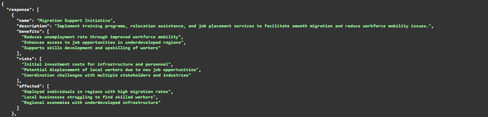

# 🧠 AI Policy Advisor Engine (LangGraph-based)

An AI-powered decision engine that analyzes structured datasets and generates **data-driven policy recommendations** using a multi-stage reasoning pipeline.

---

## 🚀 Overview

This project simulates a real-world **AI policy advisor system** that:

* Processes multi-domain datasets (economy, demographics, education, etc.)
* Extracts structured insights from data
* Uses an LLM to generate **policy decisions with benefits, risks, and impact analysis**
* Exposes everything via a **FastAPI backend**

---

## ⚡ Key Features

* 📊 **Data → Insight → Policy pipeline**
* 🧠 **LLM-powered reasoning (Groq – LLaMA 3.1)**
* 🔗 **Graph-based workflow using LangGraph**
* 🛠️ **FastAPI backend with REST endpoints**
* 🧾 Structured JSON output (policies with benefits, risks, affected groups)
* 🔁 Retry + fallback handling for robustness

---

## 🧩 Unique Aspect (What makes this stand out)

Unlike typical LLM apps, this system uses **LangGraph** to model the AI pipeline as a **graph-based workflow**.

👉 Instead of sending a single prompt to the LLM:

* Data is first transformed into **structured signals (chart extracts)**
* These signals are passed through **multiple reasoning stages**
* Each stage is a node in a graph (insights → policy generation)

> This enables **modular, explainable, and production-style AI reasoning**, closer to real-world AI systems.

---

## 🏗️ System Architecture

```
User Query
   ↓
Load Data (CSV datasets)
   ↓
Extract Dashboards (structured signals)
   ↓
Generate Insights (LLM reasoning)
   ↓
Generate Policies (LLM decision layer)
   ↓
Structured JSON Output
```

---

## 📂 Project Structure
```
ai-policy-advisor-engine/
│
├── ai_engine/
│   ├── main.py               # FastAPI entry point
│   ├── graph.py              # LangGraph pipeline
│   ├── dashboard_extractor.py   # Data → insights extraction
│
├── data/                  # CSV datasets
├── assets/
│   └── api_demo.png
├── sample_outputs/
│   └── sample_policy_output.json
├── .env                   # API keys
├── requirements.txt
└── README.md
```

---

## ⚙️ Tech Stack

* **Backend:** FastAPI
* **AI/LLM:** Groq (LLaMA 3.1)
* **Orchestration:** LangGraph
* **Data Processing:** Pandas
* **Language:** Python

---

## ▶️ Running the Project

### 1. Clone the repo

```bash
git clone https://github.com/payaldongre/ai-policy-advisor-engine.git
cd ai-policy-advisor-engine
```

### 2. Install dependencies

```bash
pip install -r requirements.txt
```

### 3. Add API key

Create a `.env` file:

```env
GROQ_API_KEY=your_api_key_here
```

### 4. Run server

```bash
uvicorn ai_engine.main:app --reload
```

### 5. Open API docs

```
http://127.0.0.1:8000/docs
```

---

## 📡 API Endpoints

### 🔹 Health Check

```http
GET /
```

Returns the service status.

---

### 🔹 Generate Policy

```http
POST /policy
```

Generates data-driven policy recommendations using the AI pipeline.

#### 📥 Request Body

```json
{
  "message": "Reduce unemployment without increasing inflation"
}
```

#### 📤 Response (Simplified)

```json
{
  "response": [
    {
      "name": "...",
      "description": "...",
      "benefits": ["..."],
      "risks": ["..."],
      "affected": ["..."]
    }
  ],
  "chart_extracts": { ... },
  "warnings": []
}
```

> The response includes structured policies along with supporting data insights and any non-critical warnings.

---

## 🧾 Sample Output (Truncated)
{
  "response": [
    {
      "name": "Migration Support Initiative",
      "description": "Implement training programs, relocation assistance, and job placement services to facilitate smooth migration and reduce workforce mobility issues.",
      "benefits": [
        "Reduces unemployment rate through improved workforce mobility",
        "Enhances access to job opportunities in underdeveloped regions",
        "Supports skills development and upskilling of workers"
      ],
      "risks": [
        "Initial investment costs for infrastructure and personnel",
        "Potential displacement of local workers due to new job opportunities",
        "Coordination challenges with multiple stakeholders and industries"
      ],
      "affected": [
        "Employed individuals in regions with high migration rates",
        "Local businesses struggling to find skilled workers",
        "Regional economies with underdeveloped infrastructure"
      ]
    }
  ]
}

> Output truncated for readability. Full response includes multiple policies and multi-domain insights.

---

## 📡 API Demo


---

## 📂 Full Output

A complete JSON response is available here:

📄 sample_outputs/sample_policy_output.json

---

## 🎯 Use Cases

* Policy simulation and testing
* Data-driven governance insights
* AI-assisted decision making
* Smart city / urban planning tools

---

## 🧠 Key Learnings

* Designing **multi-step AI pipelines** instead of single prompts
* Handling **LLM unpredictability with fallback + parsing**
* Using **graph-based orchestration (LangGraph)** for modular AI systems
* Building **production-ready AI APIs**
* **Structuring outputs** for real-world usability

---

## 🚀 Future Improvements

* Add RAG (Retrieval-Augmented Generation)
* Policy scoring & ranking system
* Frontend dashboard for visualization
* Integration with real-world datasets

---

## 📌 One-line Summary

> Built a graph-based AI policy advisor that transforms structured datasets into actionable policy recommendations using LLM reasoning.

---
> 📊 Sample datasets are included in the repository for demonstration purposes.
---