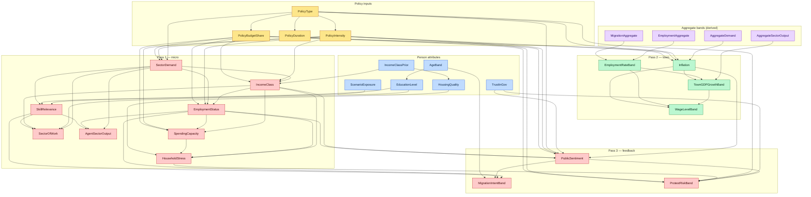

# Bayesian Network structure

_Educational reference for the Inference Lab model_

> Generated by reading `src/simulation/bn.ts`. Every row below is taken from the
> actual `DOMAINS`, `PARENTS`, `POLICY_SHIFT_DIMS`, `PRIORS`, `LATENT_SHIFTS`,
> `observedStateFor`, `policyLogShift`, `MICRO_NODES`, `TOWN_NODES`,
> `FEEDBACK_NODES` and `AGGREGATE_NODES` definitions. If the code changes, this
> file must change with it; the Simulation Lab's **Model structure** tab renders
> the same data from these definitions so it cannot drift.

`BN_VERSION = "1.0.0"`. There are **29 nodes**. Inference is ancestral
(forward) sampling, exact for this query pattern because all evidence sits on
roots or near-roots (the runtime guard `assertEvidenceIsUpstream` enforces it).

## How to read the provenance column

| Tag | Meaning |
| --- | --- |
| **counted** | CPT counted directly from the generated population (with Laplace smoothing, `ALPHA = 1`). |
| **counted + prior** | Base table counted from population, then reweighted by a documented prior (a latent-parent `LATENT_SHIFTS` row and/or a policy shift). |
| **assumed** | No observable parent: a documented `PRIORS` distribution. |
| **derived** | Set deterministically from population totals at runtime (the aggregate bands); its stored table is a uniform placeholder that is overridden by evidence every period. |
| **intervention** | Built by `withIntervention` (`do(...)`): a point mass. |

`observedStateFor` is the function that makes a node "observable". Nodes it does
**not** handle (`Aggregate*`, `Inflation`, `EmploymentRateBand`,
`TownGDPGrowthBand`, `WageLevelBand`, `SectorDemand`, `AgentSectorOutput`) are
treated as latent for CPT-learning purposes.

---

## 1. Node table

### Policy inputs (exogenous roots — pass 0)

| Node | Level | States | Represents | Provenance | Why it exists |
| --- | --- | --- | --- | --- | --- |
| `PolicyType` | policy | none, tax, subsidy, regulation, housing, labor, education | Which instrument is applied | **assumed** (uniform) | Selects the instrument channel; read by `policyLogShift`. |
| `PolicyIntensity` | policy | low, medium, high | How strongly the instrument is applied (0–1 → 3 bands) | **assumed** (uniform) | Scales every policy shift (`intensityScale` 0.35 / 0.65 / 1.0). |
| `PolicyBudgetShare` | policy | low, medium, high | Budget relative to the reference envelope | **assumed** (uniform) | Scales every policy shift (`budgetScale` 0.3 / 0.6 / 1.0). |
| `PolicyDuration` | policy | short, medium, long | Planned programme length | **assumed** (uniform) | Declared for completeness. ⚠️ **Has no effect**: it is not a parent of any node and `policyLogShift` never reads it (see §8). |

The policy shift is `s = intensityScale × budgetScale`; an unspecified dimension
falls back to the *medium* scaling, never to "weakest".

### Person attributes (exogenous roots — pass 0, per agent)

| Node | Level | States | Represents | Provenance | Why it exists |
| --- | --- | --- | --- | --- | --- |
| `IncomeClassPrior` | person | bpl, low, lower_middle, middle, upper_middle, high | The agent's starting household earning class | **counted** | Prior for the dynamic `IncomeClass`; parent of `HousingQuality`. |
| `AgeBand` | person | 0-6 … 65+ | Census age bracket | **counted** | Gates education and migration intent. |
| `EducationLevel` | person | none, primary, secondary, higher_secondary, graduate | Attained education | **counted** (parent `AgeBand`) | Drives skill relevance and sector of work. |
| `HousingQuality` | person | poor, adequate, good | Dwelling quality | **counted** (parent `IncomeClassPrior`) | Feeds household stress; upgraded by housing policy in the trajectory loop. |
| `TrustInGov` | person | low, medium, high | Confidence in government | **counted** (from `trustInGov`) | Modifies sentiment and protest. |
| `ScenarioExposure` | person | low, medium, high | AI exposure of the agent's tasks | **counted** (from `taskExposure`) | Transmits the AI scenario into skill relevance. |

### Aggregate bands (pass 0.5 — computed from the population each period)

| Node | Level | States | Represents | Provenance | Why it exists |
| --- | --- | --- | --- | --- | --- |
| `AggregateDemand` | town | weak, normal, strong | Town demand pressure band | **derived** | Input to `Inflation`; smears micro spending into a macro band. |
| `AggregateSectorOutput` | town | declining, stable, rising | Aggregate sector output movement | **derived** | Input to `TownGDPGrowthBand`. |
| `EmploymentAggregate` | town | low, normal, high | Town employment band | **derived** | Input to `EmploymentRateBand`. |
| `MigrationAggregate` | town | low, normal, high | Cumulative migration band | **derived** | Second input to `EmploymentRateBand` (migration shrinks the labour pool). |

### Person outcomes — pass 1 (micro)

| Node | Level | States | Represents | Provenance | Why it exists |
| --- | --- | --- | --- | --- | --- |
| `SectorDemand` | person | contracting, flat, growing | Demand facing the agent's sector | **assumed** (policy-conditioned) | Carrier of the policy demand shock into every downstream micro node. |
| `IncomeClass` | person | the six bands | The agent's *current* earning class | **counted + prior** (parents `IncomeClassPrior`, `SectorDemand`, policy) | Dynamic income state; policy is redistributive here. |
| `SkillRelevance` | person | obsolete, shifting, durable | Whether the agent's skills still matter | **counted + prior** (parents `ScenarioExposure`, `EducationLevel`, `SectorDemand`) | The AI-displacement channel. |
| `EmploymentStatus` | person | unemployed, informal, formal | Labour-market status | **counted + prior** (parents `IncomeClass`, `SectorDemand`, policy) | Central outcome; drives income, savings, sentiment, migration. |
| `SpendingCapacity` | person | constrained, stable, comfortable | Ability to spend (savings stock proxy) | **counted + prior** (parents `IncomeClass`, `EmploymentStatus`, policy) | Links income to household stress. |
| `HouseholdStress` | person | low, medium, high | Composed stress (poor + jobless + poor housing) | **counted** | Feeds protest; no policy parent (deliberate). |
| `SectorOfWork` | person | agriculture … informal_other | The agent's sector | **counted + prior** (parents `SectorDemand`, `EducationLevel`, `IncomeClass`, `SkillRelevance`) | Sector reallocation; written back to the population. |
| `AgentSectorOutput` | person | declining, stable, rising | The agent's own output state | **counted + prior** (parents `SectorDemand`, `EmploymentStatus`, `SkillRelevance`) | Weights the GDP identity (`OUTPUT_STATE_WEIGHT`). |

### Town outcomes — pass 2

| Node | Level | States | Represents | Provenance | Why it exists |
| --- | --- | --- | --- | --- | --- |
| `Inflation` | town | low, moderate, high | Price pressure band | **assumed + prior** (parents `AggregateDemand`, `PolicyBudgetShare`, `PolicyType`, `PolicyIntensity`) | Demand→inflation link; feeds GDP, wages and sentiment. |
| `EmploymentRateBand` | town | low, below_avg, average, above_avg, high | Town employment rate | **assumed** (parents `EmploymentAggregate`, `MigrationAggregate`) | Macro labour-market state. |
| `TownGDPGrowthBand` | town | negative, 0-1, 1-2.5, 2.5-4, above4 | Growth band | **assumed** (parents `AggregateSectorOutput`, `EmploymentRateBand`, `Inflation`) | Macro output state. |
| `WageLevelBand` | town | falling, flat, modest_growth, strong_growth, surge | Wage trend | **assumed** (parents `TownGDPGrowthBand`, `EmploymentRateBand`, `Inflation`) | Wage channel; feeds sentiment indirectly. |

### Feedback — pass 3 (town state → the individual)

| Node | Level | States | Represents | Provenance | Why it exists |
| --- | --- | --- | --- | --- | --- |
| `PublicSentiment` | person | negative, neutral, positive | Agent sentiment | **counted + prior** (parents `IncomeClass`, `EmploymentStatus`, `Inflation`, `TrustInGov`, `PolicyType`) | The bridge from macro outcomes back to protest/migration. |
| `MigrationIntentBand` | person | stay, consider, leave | Intention to leave town | **counted** (parents `EmploymentStatus`, `SkillRelevance`, `PublicSentiment`, `AgeBand`) | Drives `active = 0` attrition. |
| `ProtestRiskBand` | person | low, medium, high | Willingness to protest | **counted + prior** (parents `PublicSentiment`, `TrustInGov`, `HouseholdStress`, `PolicyType`) | Headline social-stability output. |

---

## 2 & 3. Arrow table with pass markings

`+`/`−` is the **documented expected direction** of the parent on the child.
Where the direction comes from a learned base table (both parent and child are
observable) it is **not asserted** — marked "learned". Where it comes from
`LATENT_SHIFTS` it is an **assumption**; where from `policyLogShift` it is the
policy's declared channel. "Test" names the `validateBnDirection` /
do-calculus check that exercises it.

### Policy → policy

| Parent → Child | Pass | Reason | Sign | Source | Test |
| --- | --- | --- | --- | --- | --- |
| PolicyType → PolicyIntensity/BudgetShare/Duration | policy | Structural; keeps the four policy roots coherent | n/a | assumption | — |

### Roots → person attributes

| Parent → Child | Pass | Reason | Sign | Source | Test |
| --- | --- | --- | --- | --- | --- |
| AgeBand → EducationLevel | 1 | Older cohorts attained less schooling | learned | counted | — |
| IncomeClassPrior → HousingQuality | 1 | Higher income → better housing | learned | counted | — |

### Micro causal arrows (pass 1)

| Parent → Child | Pass | Reason | Sign | Source | Test |
| --- | --- | --- | --- | --- | --- |
| SectorDemand → IncomeClass | 1 | Weak demand suppresses earnings | + (growing → higher classes) | assumption (`IncomeClass\|SectorDemand`) | — |
| SectorDemand → EmploymentStatus | 1 | Weak demand → unemployment | + | assumption | — |
| SectorDemand → SkillRelevance | 1 | Growing demand keeps skills relevant | + | assumption | — |
| SectorDemand → SectorOfWork | 1 | Demand reallocates labour across sectors | mixed | assumption | — |
| SectorDemand → AgentSectorOutput | 1 | Demand drives own output | + | assumption | — |
| ScenarioExposure → SkillRelevance | 1 | AI exposure obsolesces skills | − | learned | — |
| EducationLevel → SkillRelevance | 1 | More education → durable skills | learned | counted | — |
| EducationLevel → SectorOfWork | 1 | Education shapes sector | learned | counted | — |
| IncomeClass → EmploymentStatus | 1 | Poorer agents more likely informal/unemployed | learned | counted | — |
| IncomeClass → SpendingCapacity | 1 | Income enables spending | learned | counted | — |
| IncomeClass → HouseholdStress | 1 | Low income → stress | learned | counted | — |
| IncomeClass → SectorOfWork | 1 | Income class correlates with sector | learned | counted | — |
| EmploymentStatus → SpendingCapacity | 1 | A job enables spending | learned | counted | — |
| EmploymentStatus → HouseholdStress | 1 | Joblessness → stress | learned | counted | — |
| EmploymentStatus → AgentSectorOutput | 1 | Employed agents produce | learned | counted | — |
| SpendingCapacity → HouseholdStress | 1 | Constrained spending → stress | learned | counted | — |
| HousingQuality → HouseholdStress | 1 | Poor housing → stress | learned | counted | — |
| SkillRelevance → SectorOfWork | 1 | Durable skills reallocate better | learned | counted | — |
| SkillRelevance → AgentSectorOutput | 1 | Relevant skills raise output | learned | counted | — |

### Policy → micro/town (declared channels via `policyLogShift`)

| Parent → Child | Pass | Reason | Sign | Source | Test |
| --- | --- | --- | --- | --- | --- |
| PolicyType/Intensity/BudgetShare → SectorDemand | 1 | Instrument raises or suppresses demand | + for subsidy/labor/housing/education; − for tax/regulation | policy channel | do-calculus test (subsidy raises P(growing)) |
| Policy… → IncomeClass | 1 | Redistributive effect | subsidy/housing/tax shift mass to lower classes; education to upper | policy channel | — |
| Policy… → EmploymentStatus | 1 | Jobs effect | subsidy/labor/education/housing reduce unemployment; tax/regulation raise it | policy channel | ✔ subsidy raises P(formal) |
| Policy… → SpendingCapacity | 1 | Disposable income | subsidy/housing improve; tax constrains | policy channel | — |
| Policy… → Inflation | 2 | Demand-pull / tax pass-through | subsidy/labor/housing raise high-inflation prob; tax lowers | policy channel | ✔ high budget share raises P(high inflation) |
| Policy… → PublicSentiment | 3 | Perceived government action | subsidy/labor/housing/education improve; tax/regulation worsen | policy channel | ✔ housing improves positive sentiment |
| Policy… → ProtestRiskBand | 3 | Perceived grievance | subsidy/housing reduce; tax/regulation raise | policy channel | — |

### Aggregate → town (pass 2)

| Parent → Child | Pass | Reason | Sign | Source | Test |
| --- | --- | --- | --- | --- | --- |
| AggregateDemand → Inflation | 2 | Demand-pull | + | assumption | — |
| EmploymentAggregate → EmploymentRateBand | 2 | Direct | + | assumption | — |
| MigrationAggregate → EmploymentRateBand | 2 | Out-migration tightens the local labour market | + (low migration → lower rate) | assumption | — |
| AggregateSectorOutput → TownGDPGrowthBand | 2 | Output → growth | + | assumption | — |
| EmploymentRateBand → TownGDPGrowthBand | 2 | Labour input | + | assumption | — |
| Inflation → TownGDPGrowthBand | 2 | High inflation dampens real growth at the top band | − (only at high inflation) | assumption | — |
| TownGDPGrowthBand → WageLevelBand | 2 | Growth → wages | + | assumption | — |
| EmploymentRateBand → WageLevelBand | 2 | Tight labour market → wages | + | assumption | — |
| Inflation → WageLevelBand | 2 | High inflation erodes real wages | − | assumption | — |

### Town → feedback (pass 3)

| Parent → Child | Pass | Reason | Sign | Source | Test |
| --- | --- | --- | --- | --- | --- |
| IncomeClass → PublicSentiment | 3 | Poorer agents less positive | learned | counted | — |
| EmploymentStatus → PublicSentiment | 3 | Joblessness sours sentiment | learned | counted | — |
| Inflation → PublicSentiment | 3 | High inflation → negative sentiment | − | assumption | — |
| TrustInGov → PublicSentiment | 3 | Trust colours sentiment | learned | counted | — |
| EmploymentStatus → MigrationIntentBand | 3 | Joblessness → leaving | learned | counted | ✔ (unemployed + obsolete → consider/leave) |
| SkillRelevance → MigrationIntentBand | 3 | Obsolete skills → leaving | learned | counted | ✔ same test |
| PublicSentiment → MigrationIntentBand | 3 | Negative sentiment → leaving | + | assumption | — |
| AgeBand → MigrationIntentBand | 3 | Younger agents more mobile | learned | counted | — |
| PublicSentiment → ProtestRiskBand | 3 | Negative sentiment → protest | + | assumption | — |
| TrustInGov → ProtestRiskBand | 3 | Low trust → protest | learned | counted | — |
| HouseholdStress → ProtestRiskBand | 3 | Material stress → protest | + | assumption | — |

### Passes summary

- **Pass 0 (input):** all policy nodes + agent-attribute roots.
- **Pass 1 (micro):** `SectorDemand`, `IncomeClass`, `SkillRelevance`, `EmploymentStatus`, `SpendingCapacity`, `HouseholdStress`, `SectorOfWork`, `AgentSectorOutput`.
- **Pass 0.5 (aggregate):** `AggregateDemand`, `AggregateSectorOutput`, `EmploymentAggregate`, `MigrationAggregate` — computed by `aggregateBands`, not sampled.
- **Pass 2 (town):** `Inflation`, `EmploymentRateBand`, `TownGDPGrowthBand`, `WageLevelBand`.
- **Pass 3 (feedback):** `PublicSentiment`, `MigrationIntentBand`, `ProtestRiskBand`.

---

## 4. Which nodes each instrument touches through `do(...)`

`do(X = x)` is built by `withIntervention`, which cuts X's incoming edges and
sets a point mass. The engine conditions on the four policy roots as evidence;
the *causal* form is used by the validation layer. The instruments then reach
the graph through `policyLogShift` on exactly these nodes:

| Instrument | Nodes whose shift is non-null |
| --- | --- |
| `none` | — |
| `subsidy` | SectorDemand, IncomeClass, EmploymentStatus, SpendingCapacity, Inflation, PublicSentiment, ProtestRiskBand |
| `tax` | SectorDemand, IncomeClass, EmploymentStatus, SpendingCapacity, Inflation, PublicSentiment, ProtestRiskBand |
| `housing` | SectorDemand, IncomeClass, EmploymentStatus, SpendingCapacity, Inflation, PublicSentiment, ProtestRiskBand |
| `labor` | SectorDemand, EmploymentStatus, Inflation, PublicSentiment |
| `education` | SectorDemand, IncomeClass, EmploymentStatus, PublicSentiment |
| `regulation` | SectorDemand, EmploymentStatus, PublicSentiment, ProtestRiskBand |

`subsidy`, `tax` and `housing` share the same *reach* (all seven nodes) but
opposite signs; `labor`, `education` and `regulation` reach fewer nodes. Note
that every instrument touches `SectorDemand`, `EmploymentStatus` and
`PublicSentiment`; only `labor` and `education` leave `ProtestRiskBand`
untouched.

---

## 5. Mermaid flowchart (colour-coded)

---

## 6. Model-structure rendering

The Simulation Lab renders this graph from the same definitions in `bn.ts`
(via `DOMAINS`, `PARENTS`, `POLICY_SHIFT_DIMS` and each CPT's `provenance`), so
the diagram cannot drift from the code. The hover badge on each node shows its
counted-vs-assumed tag. See `src/simulation/bn.ts` for the definitions and the
**Model structure** tab in `src/pages/SimulationLab.tsx`.

---

## 7. Unjustified nodes or arrows (flagged)

- **`PolicyDuration`** is a graph node with a prior but **no outgoing arrow and
  no reader**: it is not in any `PARENTS` list and `policyLogShift` never
  consults it. The `validateBnDirection` case "long education policy raises
  high-growth probability" passes because of `PolicyType`/`PolicyIntensity`/
  `PolicyBudgetShare`, **not** duration. It has **no effect on any output**.
- **Scenarios are nearly inert.** `SCENARIO_PRESETS` define `capability`,
  `autonomy`, `productivity` and `reallocationMonths`, but the only lever the
  engine reads is `scenario.adoption` (in `simulate.ts`, feeding
  `adoptionRamp → exposureOf → ScenarioExposure`). The other four are dead
  parameters. See §5 of the review notes.
- **`Aggregate*` stored CPTs are placeholder uniform tables.** They are
  overwritten as evidence each period, so the `PRIORS` entries for them are
  never used for sampling. Correct, but the `derived_from_aggregation` tag is a
  runtime statement, not a learned distribution.
- **No node is fully orphaned**, but `AgentSectorOutput`, `SectorOfWork` and
  `SpendingCapacity` are **leaves**: their only downstream effect is through
  state written back into the population (GDP weight, sector counts, savings
  clamp), not through another BN node. They do affect outputs, so they are
  justified — but they should not be mistaken for parents of anything.
